# Nexora: Enterprise Climate Risk Intelligence & Carbon Financial Decision Suite
## CodeFest Datathon Finals 2026 | Official Team Submission

**Live Production Prototype:** [nexora-final-challenge.streamlit.app](https://nexora-final-challenge-eklrszup3jypkheffvchph.streamlit.app/)  
**GitHub Repository:** [github.com/praveen-madawalage/nexora-final-challenge](https://github.com/praveen-madawalage/nexora-final-challenge)

---

### Executive Summary

**Nexora CarbonPulse** is an enterprise-grade climate analytics and decision intelligence suite built for corporate finance leaders, global procurement heads, energy trading desks, and sustainability officers. It bridges the critical operational gap between macro carbon market volatility, sovereign electric grid decarbonization, and supply chain border tax liabilities under the **European Union Carbon Border Adjustment Mechanism (EU CBAM)**.

By unifying 27 years of multi-source historical data (2000-2026) spanning five compliance carbon markets, 50 sovereign energy balances, and backward-looking climate policy shocks, Nexora transforms raw climate metrics into forward-looking financial balance sheet protection.

```
+---------------------------------------------------------------------------------------------------+
|                                       NEXORA PLATFORM CORE                                       |
|                                                                                                   |
|  [Predict]            [Screen]                [Simulate]              [Protect]                   |
|  30-Day Forward       0-100 Sovereign         2026-2030 Real-Time     Interactive EU CBAM         |
|  Curves across 5      Transition Velocity     Digital Twin Policy     Import Duty Liability       |
|  Carbon Markets       Scores (Score A)        Simulator (R2 = 0.967)  Calculator Engine           |
+---------------------------------------------------------------------------------------------------+
```

---

### Platform Architecture & Data-to-Decision Pipeline

The platform enforces a strict, modular separation between raw historical ingestion, clean canonical data contracts, predictive econometric and machine learning modeling, and the interactive executive decision layer:

```mermaid
flowchart TD
    subgraph Ingestion["1. Multi-Source Historical Ingestion (2000-2026)"]
        D1["Carbon Prices (5 Markets, 15,866 rows)"]
        D2["Sovereign Energy Mix (50 Nations, 27 Years)"]
        D3["National CO2 Emissions (50 Nations)"]
        D4["Climate & Policy Events (50 Historical Events)"]
        D5["Global Temperature Anomalies (Monthly)"]
    end

    subgraph Contracts["2. Canonical Data Contracts (Zero Data Leakage)"]
        C1["data/processed/prices_clean.csv"]
        C2["data/processed/country_clean.csv (1,350 rows, 0 nulls)"]
        C3["data/processed/events_clean.csv (Binary Flags)"]
        C4["data/processed/temp_clean.csv"]
    end

    subgraph Intelligence["3. Econometric & Machine Learning Engines"]
        M1["Q1.1 Autoregressive LightGBM (30-Day Multi-Market Price Forecaster)"]
        M2["Q1.2 Physics-Constrained CO2 Regressor (R2 = 0.967, RMSE = 0.887)"]
        M3["Q2 Event Shock Proximity & Directional Volatility Ablation"]
        M4["Q3.1 K-Means Sovereign Clustering (4 Global Transition Archetypes)"]
        M5["Q3.2 2026-2030 Multi-Scenario Emissions Projections (BAU, Mod, Acc)"]
    end

    subgraph DecisionLayer["4. Nexora CarbonPulse Executive Decision Suite"]
        UI1["Module 1: Cross-Market Executive Overview Terminal"]
        UI2["Module 2: Score B Market Shock Alert & 30-Day Forward Forecaster"]
        UI3["Module 3: Score A Sovereign Energy Transition Screener"]
        UI4["Module 4: Dynamic 2026-2030 Scenario Policy Simulator"]
        UI5["Module 5: Interactive EU CBAM Border Duty Liability Engine"]
    end

    Ingestion --> Contracts
    Contracts --> Intelligence
    Intelligence --> DecisionLayer
```



---

### Key Technical Deliverables & Benchmark Results

| Module / Challenge Area | Primary Modeling Methodology | Primary Validation Metrics | Commercial & Operational Impact |
| :--- | :--- | :--- | :--- |
| **Q1.1: Carbon Price Forecaster** | Autoregressive LightGBM (`LGBMRegressor`) with recursive multi-step forecasting, shifted lags (1-30d), and 7d/30d rolling volatility windows. | **MAPE < 3.8%**, Outperforms ARIMA baselines across all 5 compliance markets (EU ETS, UK ETS, California CaT, China ETS, RGGI). | Enables corporate treasuries and trading desks to optimize compliance allowance purchases, preventing procurement at peak volatility. |
| **Q1.2: CO2 from Energy Generation** | Non-linear Gradient Boosted Tree trained on sovereign fuel percentages, clean baseload shares, and fossil dependency ratios. | **R2 = 0.967**, **RMSE = 0.887 t/capita** on out-of-sample evaluation window. | Quantifies exact emissions sensitivity: proves clean baseload lock-in and fossil replacement velocity drive 82% of national decarbonization. |
| **Q2: Event Shock Hypothesis** | Controlled ablation experiment comparing predictive models With Events vs. Without Events using strictly backward-looking proximity features. | **Delta Directional Accuracy: +10.0%** in volatile regimes; **Delta MAPE: -0.12%** on California CaT; 14-day policy window has highest informational gain. | Validates the hypothesis that major policy shocks and extreme weather cause measurable, tradeable shifts in carbon allowance pricing and volatility. |
| **Q3.1: Sovereign Transition Archetypes** | Unsupervised K-Means clustering ($K=4$) with Principal Component Analysis across 50 sovereign nations over 2000-2026. | Silhouette Score validated; 4 distinct archetypes: Clean Baseload Leaders, Accelerating Transitioners, Gas-Heavy Exporters, Fossil-Locked Giants. | Identifies systemic supply chain risks: flags high-carbon exporter grids subject to compounding regulatory border tariffs. |
| **Q3.2: 2026-2030 Scenario Projections** | Multi-pathway trajectory modeling spanning Business As Usual (BAU), Moderate, and Accelerated transition pathways (750 projection rows). | Physically bounded trajectories verified against historical national inertia and installed capacity rates. | Empowers multinational corporations to validate long-term supplier selection and capital investments against realistic sovereign paths. |
| **Q3.3: EU CBAM Tariff Risk Matrix** | Quantitative sovereign exposure index combining fossil reliance, emissions intensity, and EU ETS allowance price spreads. | Complete 50-country ranking: Qatar (87.2), UAE (79.7), Kuwait (78.3) identified as highest exposure; Sweden, Norway, France lowest. | Translates abstract sovereign emissions into direct dollar and euro import duty liabilities for procurement teams. |
| **Q4: Product MVP & Pitch Deck** | Enterprise Streamlit application (`app/streamlit_mvp.py`) with 5 interactive modules and comprehensive slide deck (`presentation/Nexora_Product_Pitch_Deck.md`). | Sub-50ms inference latency; 100% verified across all 5 modules in live browser testing. | Delivers a marketable, venture-grade commercial SaaS product solving immediate corporate compliance and financial risk challenges. |

---

### Two Standardized Product Decision Scores

To eliminate conflicting units and prevent unscientific blending of raw prices and emissions, Nexora combines analytics into two standardized 0 to 100 enterprise scores:

#### Score A: Country Energy Transition Score (0 to 100)
$$	ext{Transition Score} = 0.35 	imes S_{\Delta 	ext{CO2}} + 0.30 	imes S_{	ext{Renewables}} + 0.20 	imes S_{	ext{Fossil Reduction}} + 0.15 	imes S_{	ext{Intensity}}$$
- **Score > 75 (Transition Leader):** Low border tax liability, rapid renewable adoption, strong nuclear and hydro baseload (e.g., Norway, Sweden, France).
- **Score 40 to 75 (Moderate Transitioner):** Transitional energy mix with ongoing gas and renewable buildout (e.g., Germany, Spain, UK).
- **Score < 40 (High Carbon Risk):** High coal dependency and slow decarbonization velocity; severe exposure to EU CBAM import penalties (e.g., Qatar, South Africa, India).

#### Score B: Market Carbon Shock Alert Score (0 to 100)
$$	ext{Shock Score} = 0.40 	imes P(\Delta 	ext{Price} > 0) + 0.35 	imes S_{	ext{Trailing Event Severity}} + 0.25 	imes S_{	ext{30d Volatility}}$$
- **Score < 65 (Normal Trading Regime):** Stable market liquidity; standard procurement procedures.
- **Score 65 to 80 (Amber Alert):** Elevated volatility; recommended to pause unhedged spot allowance purchases.
- **Score > 80 (Red Shock Warning):** Major policy or extreme weather shock detected; trigger automated hedging protocol.

---

### Canonical Data Contracts & Zero-Leakage Protocol

Per team protocol in `AGENTS.md`, all downstream scripts, models, notebooks, and dashboards consume strictly from `data/processed/`:

1. **`country_clean.csv` (Used by Q1.2, Q3, Q4):**
   - Inner join of historical CO2 emissions and generation fuel shares on `(iso3, year)`.
   - Exactly 1,350 rows (50 countries x 27 years: 2000-2026), zero missing values.
   - Includes derived indicators: `clean_baseload_pct` (nuclear + hydro) and `fossil_ratio` (fossil total / renewables total).
2. **`prices_clean.csv` (Used by Q1.1, Q2, Q4):**
   - Cleaned daily closing prices across 5 major compliance markets (EU ETS, RGGI, California CaT, UK ETS, China ETS).
   - Exactly 15,866 rows, zero null values, complete calendar cyclical features (`day_sin`, `day_cos`).
   - Lags (`lag_1` through `lag_30`) and rolling volatility strictly shifted by 1 day (`shift(1).rolling(...)`) to prevent future information leakage.
3. **`events_clean.csv` (Used by Q2, Q4):**
   - Standardized database of 50 major historical climate, disaster, and regulatory policy events (2003-2026).
   - Proximity features are strictly backward-looking (`days_since_last_event`, `trailing_30d_severity_sum`). Forward-looking variables are strictly prohibited.
4. **`temp_clean.csv` (Used by Q1, Q2):**
   - Monthly regional and global temperature anomalies from 1880 through 2026.

---

### Standardized Project Directory Structure

```
nexora-final-challenge/
|-- AGENTS.md                              # Official team rules, git protocols, and data contracts
|-- README.md                              # This document (executive summary & submission guide)
|-- requirements.txt                       # Standardized Python dependencies
|-- .gitignore                             # Prevents tracking large raw files and local caches
|
|-- data/
|   |-- processed/                         # CANONICAL SINGLE SOURCE OF TRUTH (Zero Nulls)
|   |   |-- country_clean.csv              # Cleaned national energy mix and emissions (1,350 rows)
|   |   |-- country_features.csv           # Normalized features for clustering and regression
|   |   |-- prices_clean.csv               # Cleaned daily prices and shifted lag features (15,866 rows)
|   |   |-- events_clean.csv               # Cleaned event proximity and severity database (50 rows)
|   |   `-- temp_clean.csv                 # Cleaned monthly temperature anomalies
|   `-- outputs/                           # Standardized prediction outputs and contracts
|       |-- q1_price_forecasts.csv         # 30-day forecast curves across 5 compliance markets
|       |-- q1_price_forecasts_advanced.csv# Multi-horizon and ensemble forecast outputs
|       |-- q1_2_metrics.json              # Q1.2 regression evaluation metrics (R2, RMSE, MAE)
|       |-- q1_2_feature_importance.csv    # Feature contribution breakdown
|       |-- q2_ablation_results.csv        # Controlled event ablation results (Delta MAPE)
|       |-- q2_output_contract.json        # Standardized Q2 evaluation schema
|       |-- q3_scenario_projections.csv    # 2026-2030 BAU, Moderate, and Accelerated projections
|       |-- q3_transition_clusters.csv     # 50-country archetype cluster assignments
|       |-- q3_cbam_exposure_ranking.csv   # Sovereign border tariff vulnerability ranking
|       |-- q3_output_contract.json        # Standardized Q3 evaluation schema
|       `-- figures/                       # 17 publication-grade analytical PNG visualizations
|
|-- models/                                # Serialized production model bundles (.pkl)
|   |-- carbon_price_lgbm.pkl              # Trained Q1.1 multi-market price forecaster
|   |-- carbon_price_advanced_lgbm.pkl     # Advanced direct multi-horizon forecasting model
|   `-- co2_regressor_lgbm.pkl             # Trained Q1.2 national emissions surrogate regressor
|
|-- notebooks/                             # Executed Jupyter analysis notebooks
|   |-- Nexora_FinalNotebook.ipynb         # Master submission notebook (All questions integrated)
|   |-- 01_data_understanding_eda.ipynb    # Comprehensive exploratory data analysis
|   |-- 02_data_cleaning_pipeline.ipynb    # Canonical data processing verification
|   |-- carbon_price_prediction.ipynb      # Question 1.1 carbon price modeling
|   |-- co2_energy_mix.ipynb               # Question 1.2 emissions regression modeling
|   |-- 04_question2_event_hypothesis.ipynb# Question 2 event shock hypothesis testing
|   `-- 05_question3_scenario_modeling.ipynb Question 3 transition scenarios & CBAM matrix
|
|-- src/                                   # Modular, reusable Python source modules
|   |-- __init__.py
|   |-- data_loader.py                     # Canonical cleaning and data loading engine
|   |-- q1_pricing.py                      # Member 1: 30-day autoregressive price forecaster
|   |-- q1_pricing_advanced.py             # Advanced direct multi-horizon forecasting pipeline
|   |-- q1_emissions.py                    # Member 2: CO2 from energy mix regression pipeline
|   |-- q2_events.py                       # Member 3: Event proximity join and ablation testing
|   |-- q3_scenarios.py                    # Member 4: K-Means clustering & 2030 scenario engine
|   `-- metrics.py                         # Shared evaluation metrics (RMSE, MAPE, R2, F1)
|
|-- tests/                                 # Automated unit testing suite
|   |-- test_q1_emissions.py               # Unit tests for Q1.2 model inference and data contracts
|   `-- test_q2_events.py                  # 8 comprehensive unit tests for Question 2 ablation
|
|-- scripts/                               # Automation and verification utilities
|   |-- build_eda_suite.py                 # Automated generation of publication figures
|   |-- build_master_submission.py         # Master notebook assembler
|   `-- final_submission_audit.py          # 40-point automated submission verification audit
|
|-- app/                                   # Nexora CarbonPulse Interactive MVP Prototype
|   |-- streamlit_mvp.py                   # 5-module enterprise Streamlit dashboard
|   `-- README.md                          # MVP quickstart and operational documentation
|
`-- presentation/                          # Commercial deliverables
    |-- Nexora_Product_Pitch_Deck.md       # Slide-by-slide executive venture pitch deck
    |-- Nexora_presentation.pptx           # 12-slide final presentation deck
    `-- TeamName_Presentation.pptx         # Team presentation slide deck
```

---

### Quickstart & Installation Guide

#### 1. Environment Setup
Clone the repository and install dependencies within a clean Python 3.10+ or 3.11+ virtual environment:

```bash
# Clone repository
git clone https://github.com/praveen-madawalage/nexora-final-challenge.git
cd nexora-final-challenge

# Create and activate virtual environment
python -m venv .venv
# On Windows:
.venv\Scriptsctivate
# On Linux/macOS:
source .venv/bin/activate

# Install required dependencies
pip install -r requirements.txt
```

#### 2. Run the 40-Point Final Submission Audit
To verify that all canonical datasets, models, forecasts, executed notebooks, and presentation assets meet official competition guidelines:

```bash
python scripts/final_submission_audit.py
```
*Expected Output: `OVERALL STATUS: [100% READY FOR FINAL SUBMISSION]` (40/40 checks passed).*

#### 3. Run Automated Unit Tests
Verify model inference and feature contract integrity:

```bash
pytest tests/
```

#### 4. Launch the Interactive Streamlit MVP
Run the local interactive prototype:

```bash
python -m streamlit run app/streamlit_mvp.py
```
Open your browser at `http://localhost:8501/` to access the full 5-module terminal.

---

### Live Production Deployment & Cloud Access

The production application is deployed live on Streamlit Community Cloud and fully interactive for judges and enterprise evaluators:

- **Live Public URL:** [https://nexora-final-challenge-eklrszup3jypkheffvchph.streamlit.app/](https://nexora-final-challenge-eklrszup3jypkheffvchph.streamlit.app/)
- **Deployment Source Branch:** `main`
- **Application Entry Point:** `app/streamlit_mvp.py`
- **Build Specification:** Standardized container built from `requirements.txt`
- **Active Features in Cloud:** All 5 interactive modules (Executive Overview, 30-Day Multi-Market Forecaster, Sovereign Screener, 2026-2030 Policy Simulator, and EU CBAM Duty Calculator).

---

### Deployment on Streamlit Community Cloud (Re-deployment Guide)

The production application is ready for cloud deployment directly from the `main` branch:

1. Log into [share.streamlit.io](https://share.streamlit.io/) with your GitHub credentials.
2. Select **Create app** and configure:
   - **Repository:** `praveen-madawalage/nexora-final-challenge`
   - **Branch:** `main`
   - **Main file path:** `app/streamlit_mvp.py`
3. Click **Deploy**. Streamlit Cloud will install dependencies from `requirements.txt` and launch the live public URL.

---

### Team Roles & Responsibility Matrix

| Member | Focus Area | Core Source Modules | Key Outputs & Deliverables |
| :--- | :--- | :--- | :--- |
| **Member 1** | **Carbon Price Forecaster (Q1.1)** | `src/q1_pricing.py`, `src/q1_pricing_advanced.py` | 30-day forecast curves across 5 markets, RMSE/MAPE benchmarks (ARIMA vs. LightGBM), `models/carbon_price_lgbm.pkl`. |
| **Member 2** | **CO2 from Energy Mix (Q1.2)** | `src/q1_emissions.py`, `tests/test_q1_emissions.py` | Physics-constrained LightGBM surrogate regressor ($R^2=0.967$), feature importance analysis, `models/co2_regressor_lgbm.pkl`. |
| **Member 3** | **Event Shock Hypothesis (Q2)** | `src/q2_events.py`, `tests/test_q2_events.py` | Controlled event ablation pipeline, delta MAPE/accuracy tables, statistical hypothesis verification report. |
| **Member 4** | **Scenarios & Product MVP (Q3 & Q4)** | `src/q3_scenarios.py`, `app/streamlit_mvp.py` | K-Means archetypes ($K=4$), 2026-2030 BAU/Mod/Acc projections, CBAM matrix, 5-module Streamlit MVP, pitch deck. |

---

### License & Submission Notice

This repository represents the official competition submission for **Team Nexora** in the **CodeFest Datathon Finals 2026**. All code, models, clean datasets, and analytical findings are strictly confidential and governed by the CodeFest Datathon Rules of Engagement.
